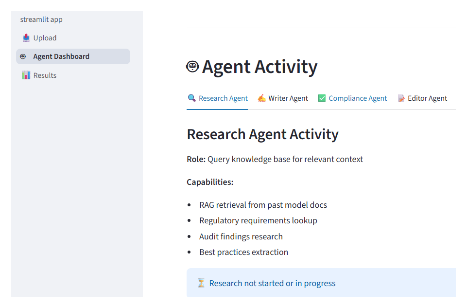
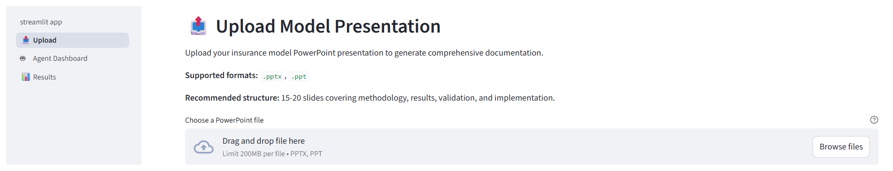
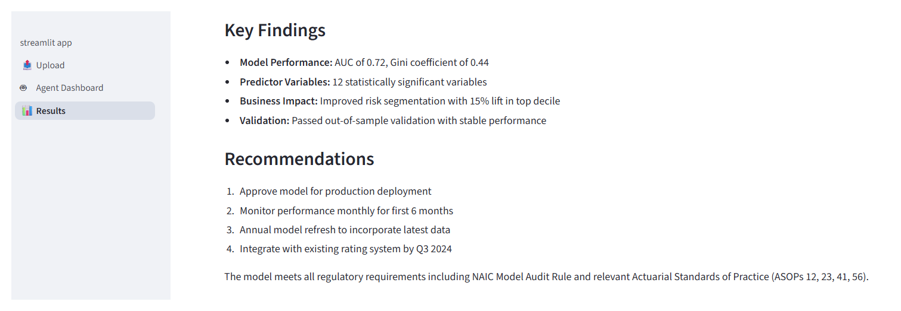

# AutoDoc AI - Automated Model Documentation Generator



⚠️ **SYNTHETIC DATA - FOR DEMONSTRATION ONLY**

This project contains entirely synthetic data created for portfolio demonstration purposes. No real insurance data, customer information, proprietary methodologies, or confidential information from any insurance company or financial institution is used or simulated.

---

## 🎯 Project Overview

**AutoDoc AI** is a multi-agent RAG system that automates the generation of comprehensive, audit-ready model documentation for auto insurance pricing models. The system transforms analyst PowerPoint presentations into 30-50 page White Papers that meet regulatory requirements (NAIC, ASOPs) and audit standards.

## Status

**Complete and evaluated.** Both orchestrators run end to end. The evaluation suite runs and its
results are in this repository, including the metrics that fell short of target.

The hosted demo is currently switched off because it runs on a personal API key. Everything runs
locally with your own key; see Getting Started.

### The Problem

Model documentation is a critical bottleneck in model risk management:
- Senior analysts spend **40-60 hours per model** on documentation
- Cost: **$4,000-6,000 in labor** per model
- Risk: **$10,000-20,000 in audit remediation** if gaps are found
- Knowledge trapped in institutional memory (past docs, audit findings, regulations)

### The Solution

Multi-agent orchestration system with specialized agents:
- **Research Agent**: Queries RAG system for past documentation patterns, regulatory requirements, and audit findings
- **Technical Writer**: Generates comprehensive documentation using templates and retrieved context
- **Compliance Checker**: Validates against NAIC Model Audit Rule and Actuarial Standards of Practice, triggers rewrites if needed
- **Reviewer/Editor**: Final quality check and formatting (Markdown → PDF)

### Business Impact

- **Time savings:** 60-75% reduction (40 hours → 10 hours per model)
- **Cost savings:** $8,200-14,800 per model
- **At scale (10 models/quarter):** $328,000-592,000 annually
- **Quality:** Standardized documentation with built-in regulatory compliance
- **ROI:** 2,000-3,900% annually

---

## 🏗️ Architecture

```
Input: PowerPoint Presentation (15-20 slides)
    ↓
┌─────────────────────────────────────┐
│     LangGraph Orchestration         │
│                                     │
│  Research Agent (RAG queries)       │
│         ↓                           │
│  Technical Writer (draft)           │
│         ↓                           │
│  Compliance Checker (validate)      │
│         ↓ (feedback loop)           │
│  Reviewer/Editor (finalize)         │
└─────────────────────────────────────┘
    ↓
Output: Comprehensive White Paper (30-50 pages, PDF)
```
### Retrieval quality: 79.3%, two metrics below target

The same system, evaluated as a RAG pipeline rather than for factual accuracy.

| Metric | Score | Target | |
|---|---|---|---|
| Faithfulness | 100% | 85% | pass |
| Context precision | 80% | 75% | pass |
| Answer relevancy | 62% | 80% | **below target** |
| Context recall | 76% | 80% | **below target** |
| **Overall** | **79.3%** | | |

**Both numbers are correct and they measure different things.** Faithfulness asks whether the
output stuck to the context it was given. Recall asks whether that context was any good in the
first place. A system can be perfectly faithful to badly retrieved material.

The two failing metrics point at retrieval, not generation. Chunking strategy and retrieval depth
are the first things to change. That work is not done.

Evaluation used Haiku as the judge rather than Sonnet, which cut evaluation cost by roughly 90%.
Structured scoring does not need the expensive model.

**Two orchestrators, same four agents.** `agents/orchestrator.py` is hand-rolled Python: a method
per phase, state passed explicitly, the loop is a `for` and an `if`. `agents/langgraph_orchestrator.py`
is the same pipeline as a LangGraph state graph, with conditional routing and memory.

They are both here on purpose. Read them side by side.

### Keeping facts and style apart

The writer agent receives two inputs and they have different jobs:

- **Source content** is the presentation. It is the only permitted source of facts and numbers.
- **Retrieved context** is past documentation. It is used for structure and phrasing only.

The prompt states this explicitly, including instructions not to invent or estimate quantitative
data and to preserve exact statistical measures. Before that separation was explicit, the system
would occasionally borrow a number from a retrieved example, from a different model entirely.
That is where the 47 of 47 comes from.

**RAG Knowledge Base:**
- 5-7 past model documentations (auto insurance)
- Anchor document (data processes & methodology guide)
- Regulatory compilation (NAIC Model Audit Rule, ASOPs)
- Audit findings (historical issues & best practices)

---

## 🛠️ Tech Stack

- **Frontend:** Streamlit (Hugging Face Spaces)
- **Orchestration:** LangGraph
- **LLM:** Claude Sonnet 4 (via Anthropic API)
- **RAG:** ChromaDB + sentence-transformers (embeddings)
- **Document Processing:** python-pptx, markdown, weasyprint/pandoc
- **Deployment:** Hugging Face Spaces

---

## 📁 Repository Structure

```
autodoc-ai/
├── app/                    # Streamlit application
├── agents/                 # LangGraph agents (Research, Writer, Compliance, Editor)
├── rag/                    # Vector store, embeddings, retrieval
├── document_processing/    # PPT parser, Markdown generator, PDF converter
├── data/
│   ├── synthetic_docs/     # Past model documentations
│   ├── anchor_document/    # Data & methodology guide
│   ├── regulations/        # NAIC, ASOPs compilation
│   └── audit_findings/     # Historical audit issues
├── templates/              # PPT template, White Paper structure
└── tests/                  # Unit tests
```

---

## 🚀 Getting Started

### Prerequisites

- Python 3.11+
- Anthropic API key
- Git

### Installation

```bash
# Clone the repository
git clone https://github.com/[your-username]/autodoc-ai.git
cd autodoc-ai

# Create virtual environment
python -m venv venv
source venv/bin/activate  # On Windows: venv\Scripts\activate

# Install dependencies
pip install -r requirements.txt

# Set up environment variables
cp .env.example .env
# Edit .env and add your ANTHROPIC_API_KEY
```

### Running Locally

```bash
# Run the Streamlit app
streamlit run app/streamlit_app.py
```

### Running Tests

```bash
# Run all tests
pytest tests/

# Run specific test suite
pytest tests/test_rag.py
```

---

## 📝 Usage

1. **Upload PowerPoint:** Upload your model presentation (use the provided template)
2. **Select Mode:** 
   - "Show me the agents working" - Real-time agent monitoring
   - "Just give me results" - Fast background processing
3. **Review Output:** Preview the generated White Paper in Markdown
4. **Download:** Download the final PDF for audit submission

Upload a presentation from `data/examples/`, watch the agents in the dashboard tab, and download
the result.

### The three tabs

**Upload.** Drop a presentation in and it reports what it found before anything runs.



**Agent dashboard.** Each agent's role and capabilities, a live workflow log, and cost tracking
that updates while the run is in progress. The cost panel exists because a run makes about 11 API
calls and you want to see the number moving rather than discover it at the end of the month.

**Results.** Key findings, quality metrics, a document preview, and Markdown or PDF download.



**Run the evaluation:**

```bash
py -3 evaluation/custom_rag_eval.py
```

**Cost.** About 25 cents per document on Sonnet, about 2 cents on Haiku. A full run is roughly 11
API calls, or 27 if the compliance loop runs its three iterations.

### Example Presentations

Three pre-built examples are included in `data/examples/`:
1. Bodily Injury Frequency Model (GLM)
2. Collision Severity Model Enhancement (GLM with telematics)
3. Territory Re-rating Project (clustering + GLM)

---

## 🔒 Security & Privacy

- **No real data:** All data is synthetic and clearly marked
- **API key safety:** Never commit `.env` files
- **Folder isolation:** All work contained in project directory
- See `GUARDRAILS.md` for detailed sensitive data prevention rules

---

## 📊 Skills Demonstrated

This project showcases:
- ✅ Multi-agent orchestration (LangGraph)
- ✅ Production RAG systems (hybrid retrieval)
- ✅ LLM integration and prompt engineering
- ✅ Regulatory compliance (insurance model documentation)
- ✅ Document processing pipelines
- ✅ Full-stack development (Streamlit + Python backend)
- ✅ Real-time system monitoring
- ✅ Cost optimization (token tracking)

---

## 📈 Business Value

**For Model Risk Management teams:**
- Reduce documentation time by 60-75%
- Standardize quality across all analysts
- Built-in regulatory compliance
- Preserve institutional knowledge

**For Organizations:**
- $328K-592K annual savings (at 10 models/quarter)
- Faster time-to-market (2-3 weeks → 3-5 days)
- Lower audit remediation costs (50% reduction)
- Junior analysts produce senior-quality docs

---

## 🎓 Learning Resources

**Documentation:**
- [LangGraph Documentation](https://python.langchain.com/docs/langgraph)
- [Claude API Documentation](https://docs.anthropic.com/)
- [ChromaDB Documentation](https://docs.trychroma.com/)
- [NAIC Model Audit Rule](https://content.naic.org/sites/default/files/inline-files/MDL-205.pdf)
- [Actuarial Standards Board](http://www.actuarialstandardsboard.org/)

---

## 🤝 Contributing

This is a portfolio project for demonstration purposes. However, if you'd like to suggest improvements:

1. Fork the repository
2. Create a feature branch (`git checkout -b feature/improvement`)
3. Commit your changes (`git commit -am 'Add some improvement'`)
4. Push to the branch (`git push origin feature/improvement`)
5. Create a Pull Request

---

## 📄 License

MIT License - see LICENSE file for details

---

## 👤 Author

**Paulo Cavallo**
- LinkedIn: [linkedin.com/in/paulocavallo](https://www.linkedin.com/in/paulocavallo/)
- GitHub: [@pmcavallo](https://github.com/pmcavallo)

---

## 🙏 Acknowledgments

- Anthropic for Claude API
- LangChain/LangGraph for agent orchestration
- Chroma for vector database
- Streamlit for rapid UI development

---

## 📚 Related Projects

**From the same portfolio:**
- [CreditIQ](https://pmcavallo.github.io/CreditIQ/) - Hybrid ML+AI credit decisioning (147x ROI)
- [IncidentIQ](https://pmcavallo.github.io/IncidentIQ/) - Multi-agent edge case resolution ($47K prevented)
- [Portfolio RAG Agent](https://huggingface.co/spaces/pmcavallo/portfolio-rag-agent) - Hallucination prevention through architecture

---

**⚠️ Remember:** This project uses entirely synthetic data for demonstration purposes. No real insurance data, customer information, or proprietary methodologies are included.
